# ForoHub 📚


ForoHub es una API diseñada para crear y gestionar foros de discusión. Los usuarios pueden crear tópicos, registrarse, iniciar sesión y obtener tokens de autenticación necesarios para acceder a otros endpoints. La documentación de la API está disponible a través de Swagger.
## Características Principales

### Diagrama de Base de Datos
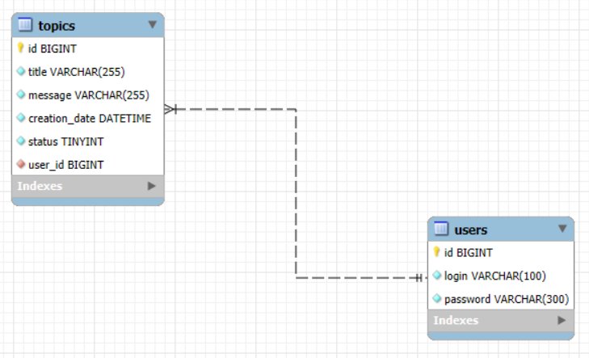

### Estructura del Proyecto
      forohub
      ├── assets/img                        -> Imágenes y recursos gráficos.
      ├── src
      │   └── main
      │       ├── java/com/qamaniatic/forohub
      │       │   ├── controller            -> Controladores REST.
      │       │   ├── domain                -> Entidades JPA y repositorios.
      │       │   │   ├── topic             -> Entidades y lógica relacionada con los tópicos.
      │       │   │   │   └── validations   -> Validaciones específicas para tópicos.
      │       │   │   └── user              -> Entidades y lógica relacionada con los usuarios.
      │       │   │       └── validations   -> Validaciones específicas para usuarios.
      │       │   └── infra
      │       │       ├── error             -> Manejadores de errores personalizados.
      │       │       ├── security          -> Configuración y servicios de seguridad.
      │       │       ├── springdoc         -> Configuración de la documentación Swagger.
      │       │       └── ForohubApplication.java -> Clase principal de la aplicación.
      │       └── resources
      │           ├── db.migration           -> Scripts SQL y migraciones con Flyway.
      │           └── application.properties -> Configuración de la aplicación.
      └── pom.xml                            -> Archivo de configuración de Maven

### Autenticación de Usuario 🔐

#### Registro de Usuario
Endpoint `/register` para registrar nuevos usuarios en el sistema.

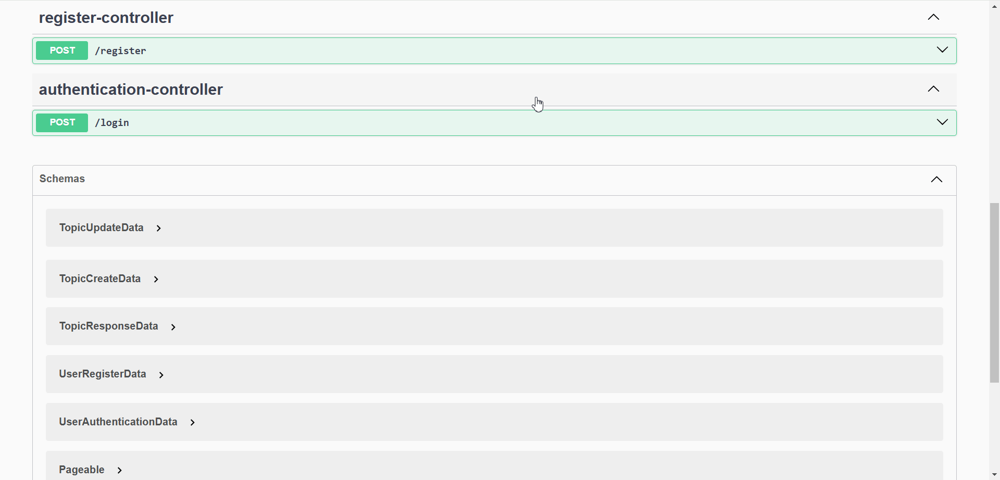

##### Validaciones de Registro de Usuarios
Se realizan las siguientes validaciones de reglas de negocio para el endpoint `/register`.

* No se puede repetir el mismo nombre de usuario.
* El nombre de usuario es obligatorio.
* La contraseña es obligatoria.

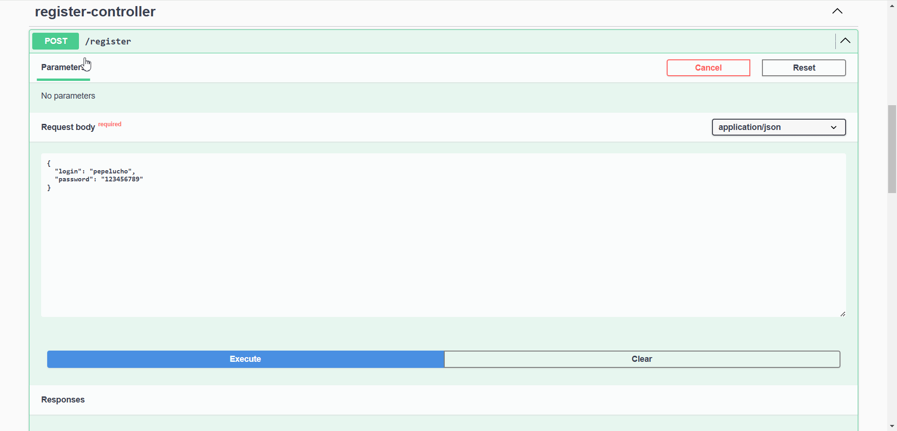

#### Inicio de Sesión
Endpoint `/login` para que los usuarios inicien sesión y obtengan un token JWT.

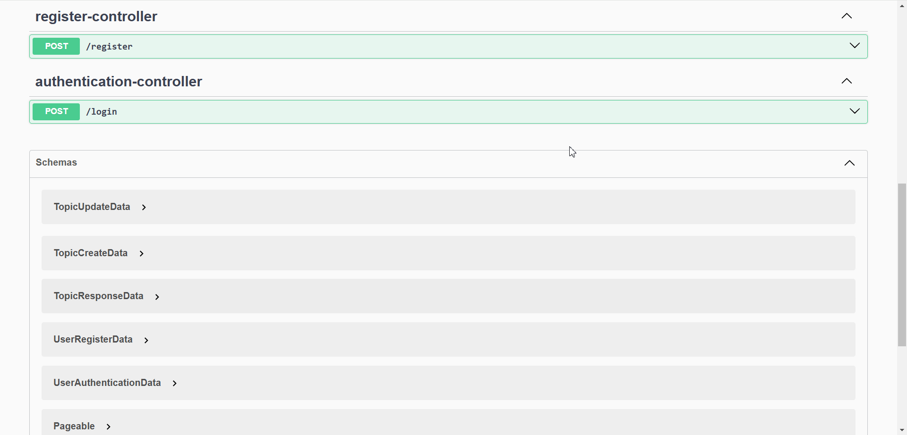

Ingresa el token en donde dice Authorize para que sea consumido por todos los endpoints.

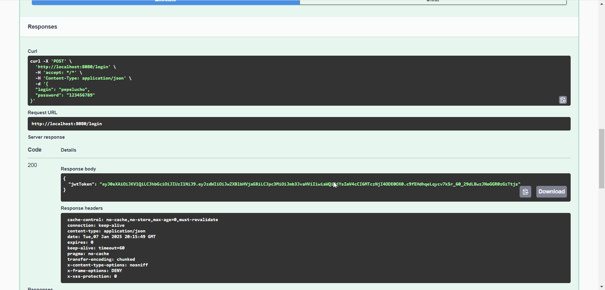

### CRUD de tópico 📝
Endpoint `/topics` que permite a los usuarios crear, leer, actualizar y eliminar tópicos en el foro.

#### Crear Tópico
`POST /topics` permite a los usuarios crear nuevos tópicos.

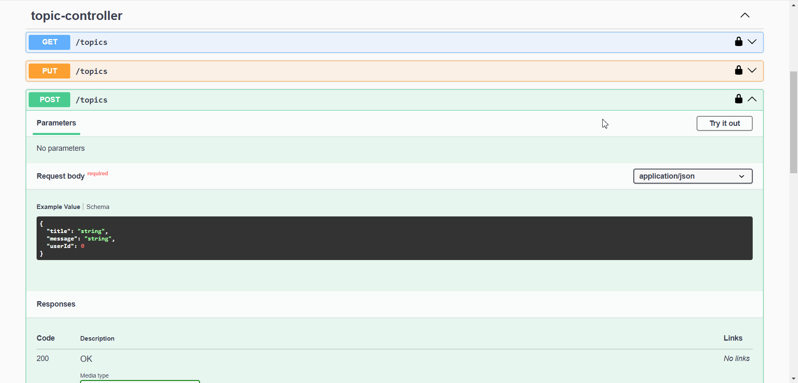

##### Validaciones de Crear Tópico
Se realizan las siguientes validaciones de reglas de negocio para el endpoint `/register`.

* No se puede repetir el mismo título.

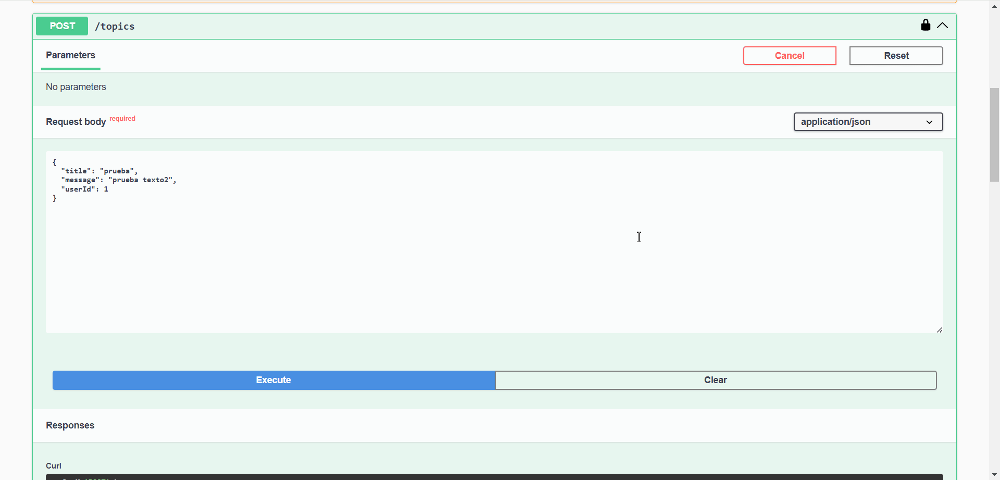

* No se puede repetir el mismo mensaje.

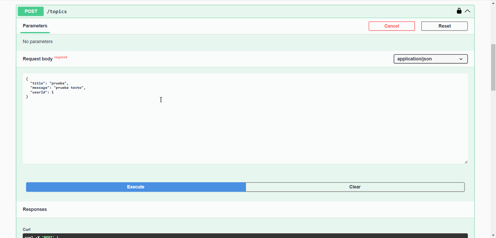

* El usuario que crea el tópico tiene que existir

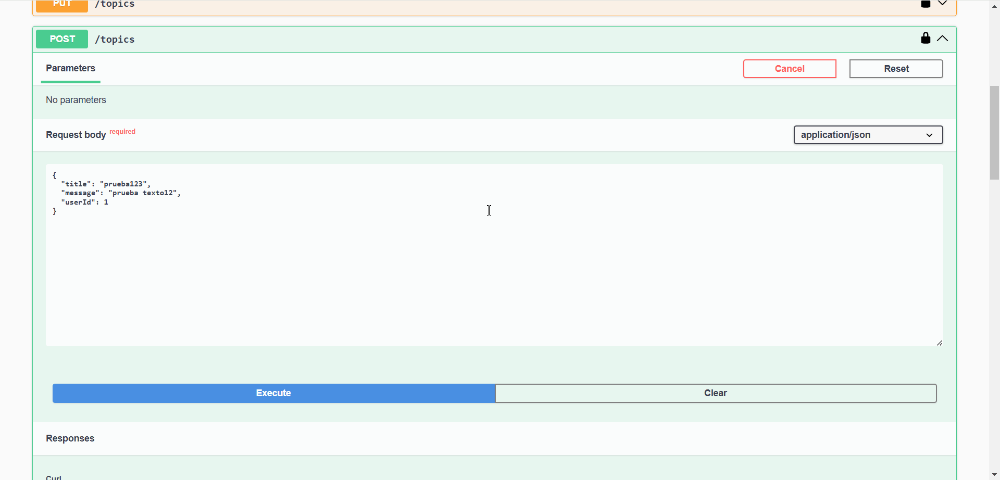

* Todos los campos son obligatorios

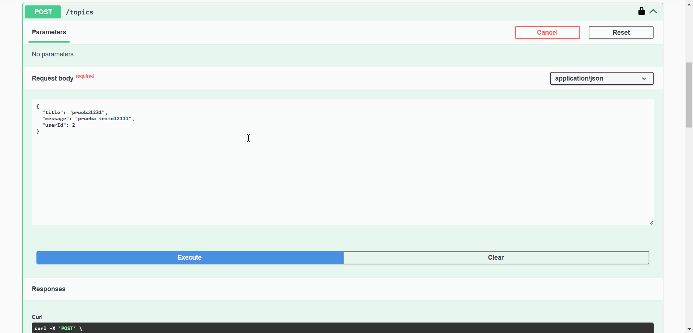

#### Listar Tópicos
`GET /topics` permite a los usuarios listar todos los tópicos.

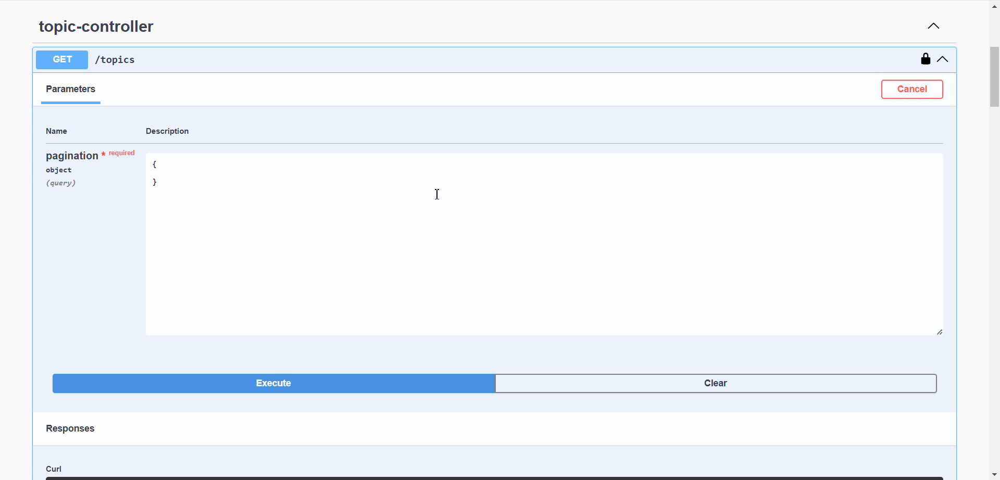

#### Ver Tópico Específico
`GET /topics/{id}` permite a los usuarios ver un tópico específico por su ID.

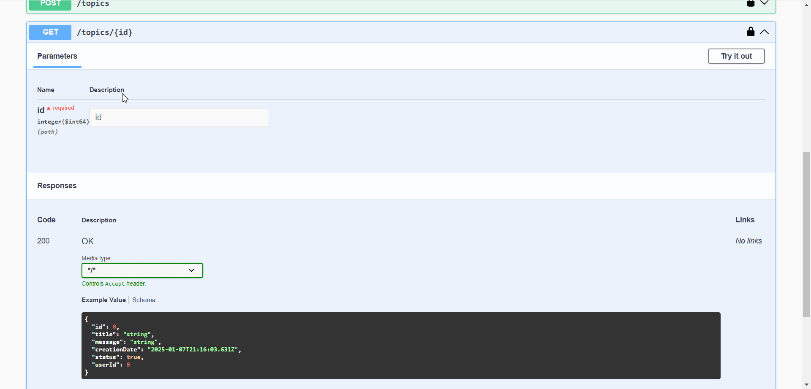

#### Actualizar Tópico
`PUT /topics` permite a los usuarios actualizar un tópico existente.

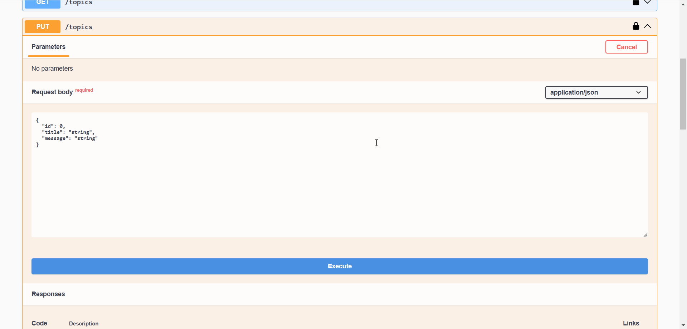

#### Eliminar Tópico
`DELETE /topics/{id}` permite a los usuarios eliminar un tópico específico.

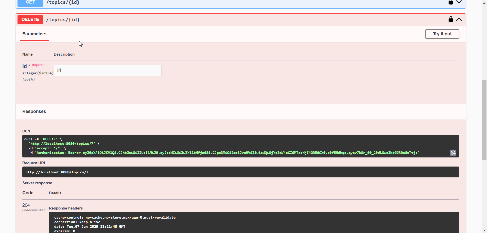

`El status "true" es activo y el "false" es inactivo.`

## Documentación de la API 📄
La documentación completa de la API estará disponible en http://localhost:8080/swagger-ui/index.html luego de desplegar localmente la API.

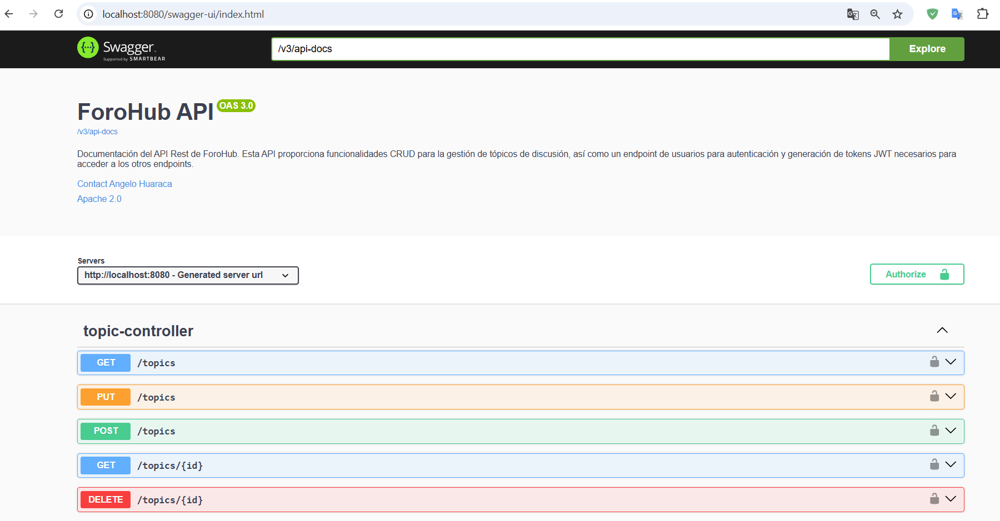
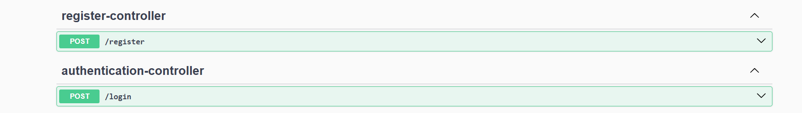


## Instalación 🔧

Si deseas tener este proyecto y desplegarlo localmente, sigue estos pasos:

### Pre-requisitos 📋

- Instalar Git
- Instalar IntelliJ (Recomendado).
- Instalar MySQL.
- Configurar tu contraseña para el usuario "root" que es el superusuario.
- Crear una base de datos con cualquier nombre (en mi caso forohub).

##### Variables de entorno
Configura las siguientes variables de entorno:

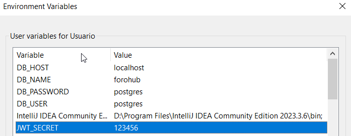

DB_HOST: localhost por defecto.  
DB_NAME: Es el nombre que asignaste a tu base de datos.  
DB_PASSWORD: Contraseña que asignaste al usuario root.  
DB_USER: root por defecto.   
JWT_SECRET: Se usa para crear y firmar el token JWT. Esto asegura que el token es válido y no ha sido alterado.

### Ejecución 💻

#### Clonar Repositorio

```bash
git clone https://github.com/ahuaracab/forohub
```

- Abrir IntelliJ
- Open -> forohub
- Espera a que se descarguen las dependencias de pom.xml o hacerlo manualmente
- Clic derecho en archivo ForoHubApplication
- Run
- Ingresar a http://localhost:8080/swagger-ui/index.html y empezar a consumir los endpoints
- O utilizar herramientas como Postman o Insomnia para construir los request manualmente.

## Autores ✒️

- **Angelo Huaraca** - _Back Developer_ - [ahuaracab](https://github.com/ahuaracab)

## Licencia 📄

Este proyecto está bajo la Licencia MIT - mire el archivo [LICENSE](LICENSE) para más detalles

## Expresiones de Gratitud 🎁

Quiero agradecer a Alura y Oracle por capacitarme en su programa ONE, sin ellos no hubiera podido tener las herramientas para desarrollar este desafío 🎓

---

Hecho con ❤️ por [Angelo Huaraca](https://github.com/ahuaracab) 😊